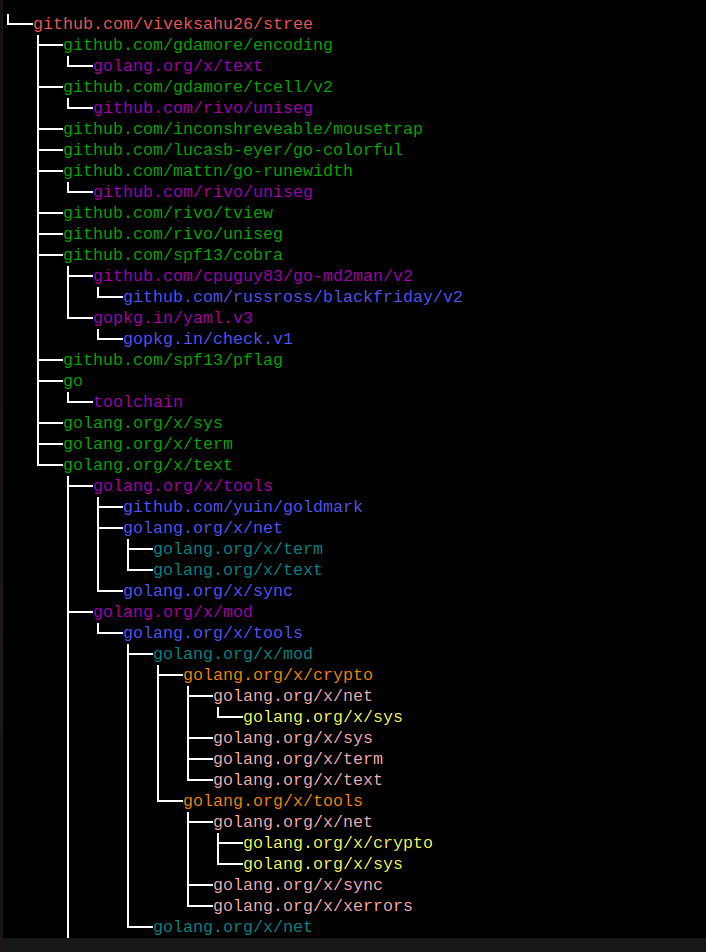
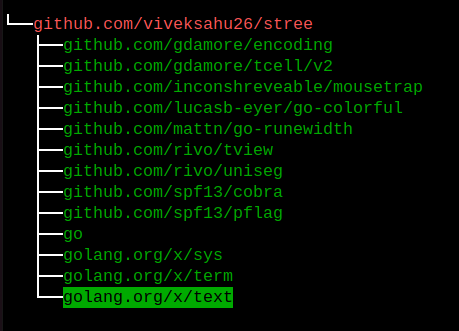
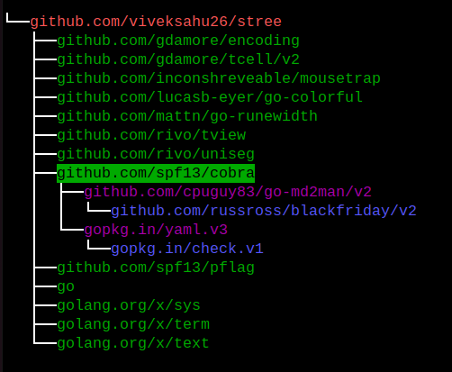
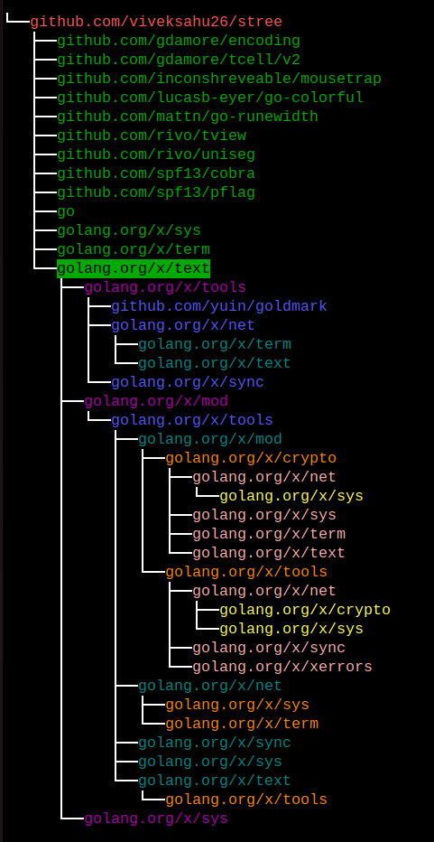

# stree

stree is tool which convert json structure into  directory tree or file tree. It's similar to `tree` command in linux.
For example:

```bash
.
$ tree
├── cmd
│   └── tree
│       ├── cli
│       │   ├── commands.go
│       │   ├── json
│       │   │   └── json.go
│       │   ├── json.go
│       │   └── options
│       │       ├── json.go
│       │       └── root.go
│       └── main.go
├── go.mod
├── go.sum
├── README.md
└── sbomqs-sca.json

5 directories, 10 files
```

## Why stree ?

Basically Json structure has parent-children kind of strucutre. In oder to visualize the relationship b/w parents-child, the stree comes into.

In the world of software and technology, every software has toms of dependencies and each dependecies has further dependencies. For a software supply chain enthusaist, it's a cusrious and required thing to visualize it's project depedencies. For now, this tool support json format.


## How to use it ??

```bash

$ stree json <stree-tree-sca.json>
└── 
    └── github.com/interlynk-io/sbomqs
        ├── github.com/CycloneDX/cyclonedx-go
        │   ├── github.com/bradleyjkemp/cupaloy/v2
        │   ├── github.com/terminalstatic/go-xsd-validate
        │   ├── github.com/xeipuuv/gojsonschema
        │   ├── github.com/xeipuuv/gojsonpointer
        │   └── github.com/xeipuuv/gojsonreference
        ├── github.com/DependencyTrack/client-go
        │   ├── github.com/google/go-cmp
        │   ├── github.com/google/uuid
        │   ├── github.com/jarcoal/httpmock
        │   └── github.com/stretchr/testify
        ├── github.com/Masterminds/semver/v3
        ├── github.com/ProtonMail/go-crypto
        │   ├── github.com/cloudflare/circl
        │   │   ├── golang.org/x/crypto
        │   │   │   ├── golang.org/x/net
        │   │   │   ├── golang.org/x/sys
        │   │   │   ├── golang.org/x/term
        │   │   │   └── golang.org/x/text
        │   │   │       ├── golang.org/x/tools
        │   │   │       │   ├── golang.org/x/net
        │   │   │       │   │   ├── golang.org/x/sys
        │   │   │       │   │   └── golang.org/x/term
        │   │   │       │   ├── golang.org/x/sync
        │   │   │       │   └── golang.org/x/text
        │   │   │       │       └── golang.org/x/tools
        │   │   │       ├── golang.org/x/mod
        │   │   │       │   ├── golang.org/x/crypto
        │   │   │       │   │   ├── golang.org/x/net
        │   │   │       │   │   │   └── golang.org/x/sys
        │   │   │       │   │   ├── golang.org/x/sys
        │   │   │       │   │   ├── golang.org/x/term
        │   │   │       │   │   └── golang.org/x/text
        │   │   │       │   └── golang.org/x/tools
        │   │   │       │       ├── golang.org/x/net
        │   │   │       │       │   ├── golang.org/x/crypto
        │   │   │       │       │   ├── golang.org/x/sys
        │   │   │       │       │   └── golang.org/x/text
        │   │   │       │       ├── golang.org/x/sync
        │   │   │       │       └── golang.org/x/xerrors
        │   │   │       └── golang.org/x/sys
        │   │   └── golang.org/x/sys
        │   └── golang.org/x/crypto
        │       ├── golang.org/x/net
        │       ├── golang.org/x/sys
        │       ├── golang.org/x/term
        │       └── golang.org/x/text
        │           ├── golang.org/x/tools
        │           │   ├── golang.org/x/net
        │           │   │   ├── golang.org/x/term
        │           │   │   └── golang.org/x/text
        │           │   └── golang.org/x/sync
        │           ├── golang.org/x/mod
        ├── sigs.k8s.io/yaml
        └── toolchain
```

### Images









## Software Supply Chain Security usecases

```bash
# generate list of componenets in json format from go modules
$ opensca-cli -path go.mod  -out tree-sca.json

# Now, convert that components into directory structure for easy visualization
$ go run cmd/stree/main.go  json --out tree1-output.json  stree-tree-sca.json

```

**NOTE**:

- Install opensca-cli tool from [here](https://github.com/XmirrorSecurity/OpenSCA-cli/releases).
