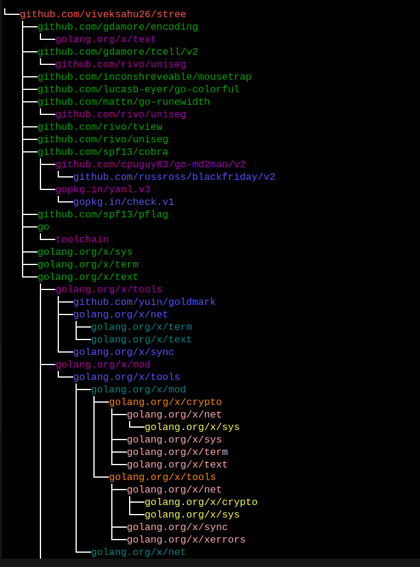
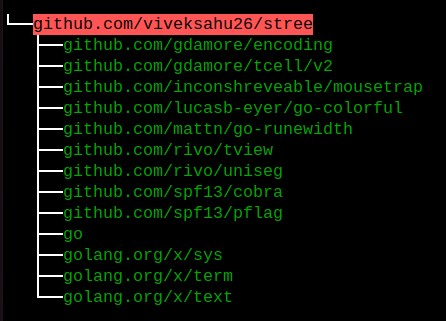
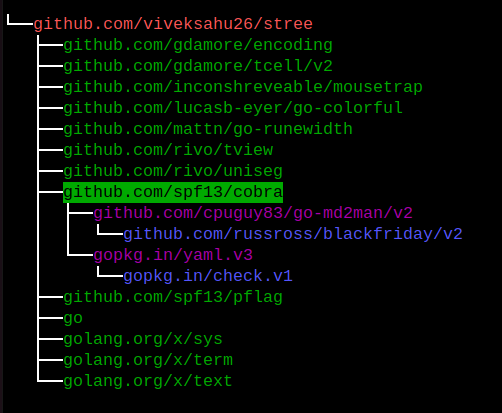
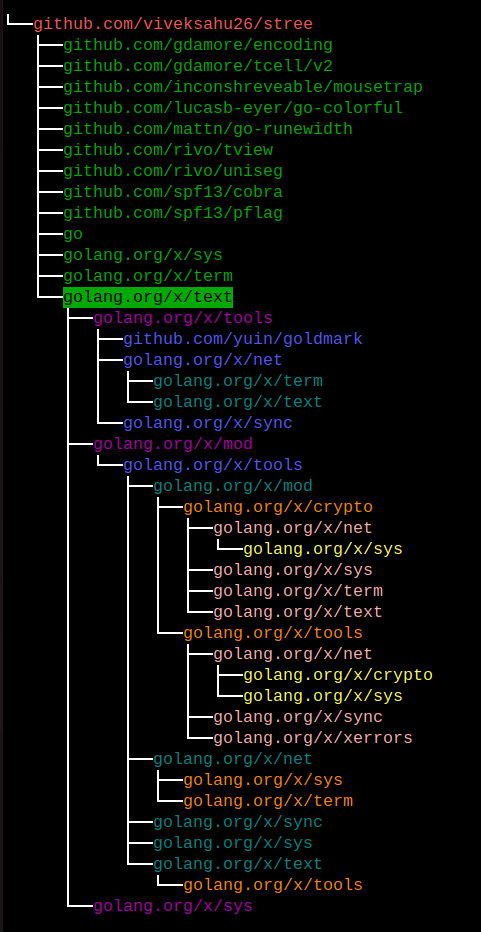

# stree

stree is CLI tool which convert SBOM dependencies into directory tree or file tree structure. It's similar to `tree` command in linux.

For example:

```bash

# tree command in linux
$ tree
├── cmd
│   └── tree
│       ├── cli
│       │   ├── commands.go
│       │   ├── json
│       │   │   └── json.go
│       │   ├── json.go
│       │   └── options
│       │       ├── json.go
│       │       └── root.go
│       └── main.go
├── go.mod
├── go.sum
├── README.md
└── sbomqs-sca.json

5 directories, 10 files
```

## Getting Started with stree: 101

```bash
# clone repository
$ git clone git@github.com:viveksahu26/stree.git

$ cd stree/cmd/stree/

# build your binary
$ go build

# For help
$ ./stree -h

# get tree-view structure dependencies for your SBOM
$ ./stree sbom  ../../samples/sbomqs-fossa-cyclonedx.json
```

## Why stree ?

An SBOM (Software Bill of Materials) essentially serves as an inventory or list of software components, each of which may have its own dependencies. The `stree` tool is designed to help visualize the relationships between these components and their dependencies.

In the world of software and technology, every software has tons of dependencies and each dependencies has further dependencies. For a software supply chain enthusaist, it's a curious and required thing to visualize it's project depedencies.

## How to use it ??

```bash

$ stree sbom samples/sbomqs-fossa-cyclonedx.json

SBOM                                                                                                                                                    
├──github.com:viveksahu26/sbomqs.git$14e7376fa2b00c102a9ba89fd5ccc7cf26f2f255                                                                           
├──pkg:github/DependencyTrack/client-go                                                                                                                 
├──pkg:github/spf13/cobra                                                                                                                               
├──pkg:github/CycloneDX/cyclonedx-go                                                                                                                    
├──pkg:github/google/go-github                                                                                                                          
├──pkg:github/github/go-spdx                                                                                                                            
├──pkg:github/samber/lo                                                                                                                                 
├──pkg:github/package-url/packageurl-go                                                                                                                 
├──pkg:github/kubernetes-sigs/release-utils                                                                                                             
├──pkg:github/Masterminds/semver                                                                                                                        
├──pkg:github/olekukonko/tablewriter                                                                                                                    
├──pkg:github/spdx/tools-golang                                                                                                                         
├──pkg:github/google/uuid                                                                                                                               
├──git+gopkg.in/yaml.v2$7649d4548cb53a614db133b2a8ac1f31859dda8c                                                                                        
├──pkg:github/uber-go/zap                                                                                                                               
├──pkg:github/cloudflare/circl                                                                                                                          
├──git+go.googlesource.com/crypto$332fd656f4f013f66e643818fe8c759538456535                                                                              
├──pkg:golang/github.com/google/go-querystring                                                                                                          
├──pkg:github/ProtonMail/go-crypto                                                                                                                      
├──pkg:github/common-nighthawk/go-figure                                                                                                                
├──pkg:github/spdx/gordf                                                                                                                                
├──pkg:github/mattn/go-runewidth                                                                                                                        
├──pkg:github/anchore/go-struct-converter                                                                                                               
├──pkg:github/uber-go/multierr                                                                                                                          
├──git+go.googlesource.com/oauth2$5fd42413edb3b1699004a31b72e485e0e4ba1b13                                                                              
├──pkg:github/spf13/pflag                                                                                                                               
├──git+go.googlesource.com/sys$673e0f94c16da4b6d7f550d6af66fde0c69503e4                                                                                 
├──git+go.googlesource.com/text$9c2f3a21352d1ff4e47776534e3f334b39ec0183                                                                                
├──pkg:github/rivo/uniseg                                                                                                                               
└──pkg:github/kubernetes-sigs/yaml    

```

NOTE: Press enter over nodes, it will expand and collaspe, vice-versa.

### Images









## Software Supply Chain Security usecases

```bash
# generate list of componenets in json format from go modules
$ opensca-cli -path go.mod  -out tree-sca.json

# Now, convert that components into directory structure for easy visualization
$ stree  json --out tree1-output.json  stree-tree-sca.json

```

**NOTE**:

- Install opensca-cli tool from [here](https://github.com/XmirrorSecurity/OpenSCA-cli/releases).
